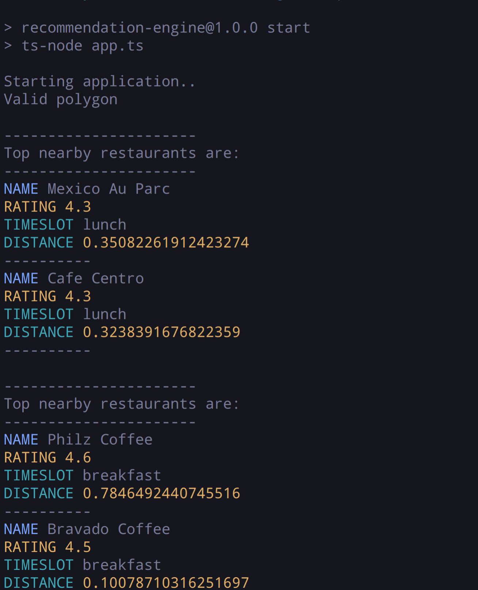

## Getting started

### Sample Data

Converted from CSV to JSON using https://csvjson.com/csv2json
All datasets are available in `./data` directory.

JSON file is easy to read in Nodejs.

### **Install framework**
This project is based on Nodejs. So you need to install Nodejs LTS and NPM first on you host machine from [here](https://nodejs.org/en/download/). Make sure to check `npm -v` command. It should work after nodejs installation.


### **Clone application on local machine**
```sh
git clone git@github.com:AmreeshTyagi/recommentation-engine.git
```
### **Install application and dependencies**

```sh
npm install
```
This command will install all dependencies & dev dependencies.

### **Run application**

This application can be run with or without passing any runtime arguments.

Running with npm
   ```sh
   npm run start
   ```



### Issues
There can be some bugs into this code. Feel free to report issue or raise PR.